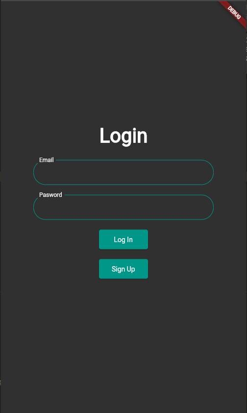
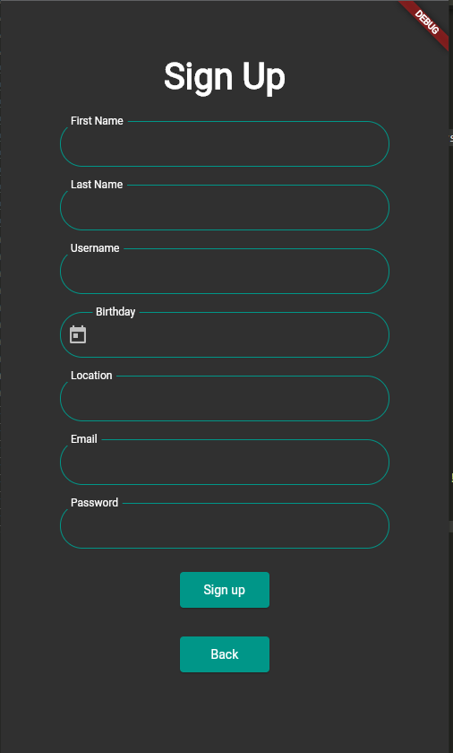
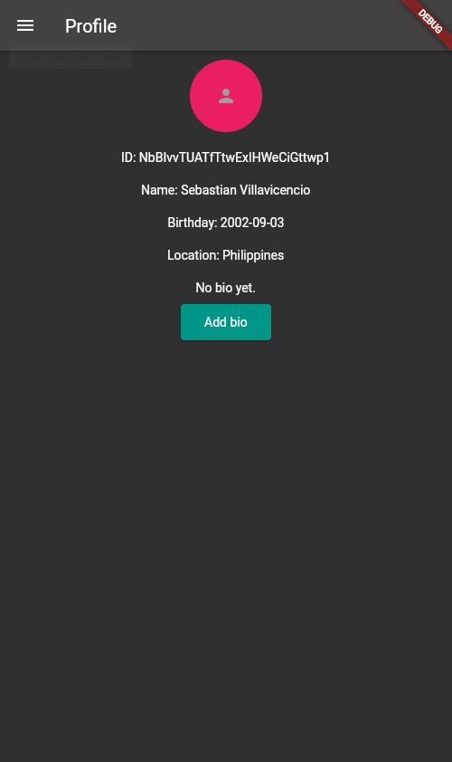
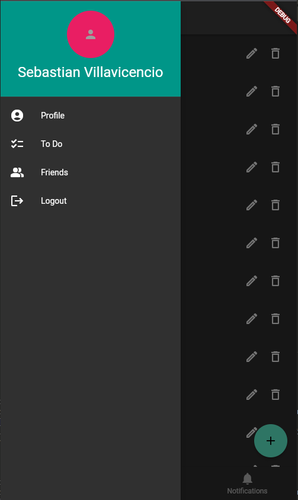
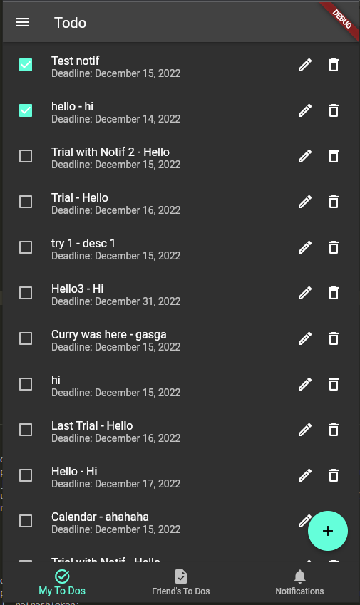
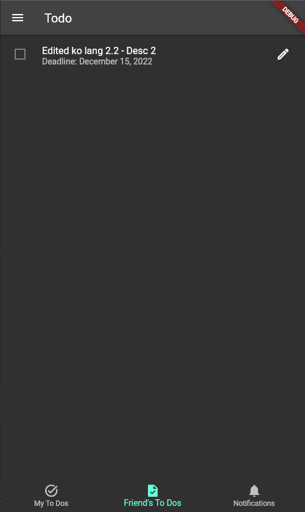
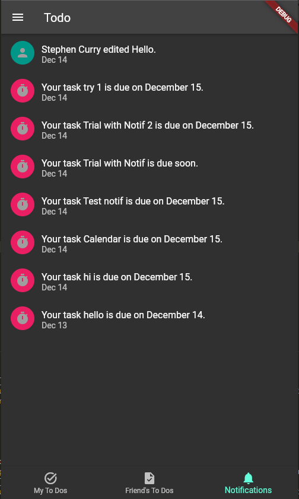
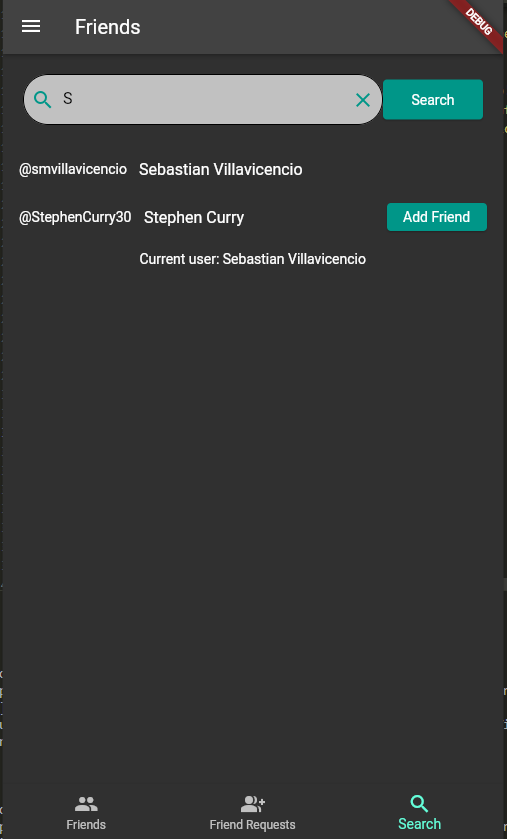
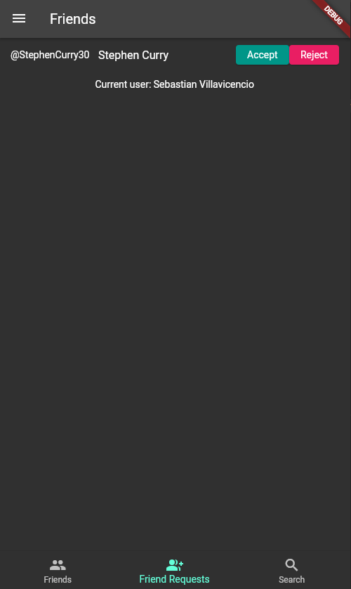
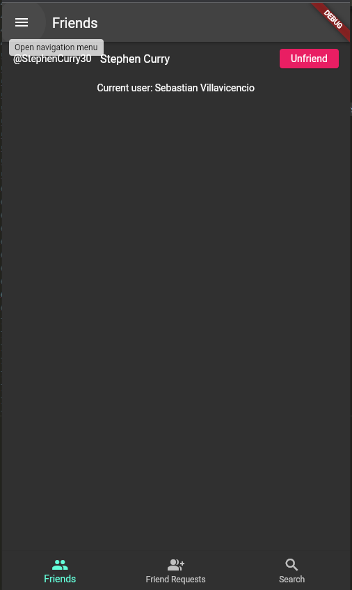

# CMSC 23 Final Project: Shared To Do Application
Flutter mobile application composed of a sign in, sign-up and a shared todo list features with a user’s friends. 

### Sebastian M. Villavicencio
### 2020-06249
### CMSC 23 - D5L

## Screenshots

## Things you did in the code
Most of the code came from past exercises. I modified the models so that it will comply with the project specifications. The Todo notifications are only a page and does not inform the user whenever a notification is added. 

## Challenges faced
1. I tried connecting the application to the calendar but the emulator only has a Google Calendar and no local calendar.
2. Sending notifications using flutter_local_notifications without clicking a button. Firebase Functions would have been a great help to trigger whenever there are changes in the database however, it requires payment to use it.

## Test Cases
### Happy Paths
1. Log-in and Signup has validators for every field required.
2. Users have their own profiles where their ID, Name, Birthday, Location, and Bio are seen. They can add bio if they have none or edit when there is already an existing bio. Users can also visit the profile of their Friends where they can see the same details but cannot add/edit the bio.
3. Users can add friends, unfriend, cancel friend request, and accept and reject friend requests.
4. Users can search for other users using a search bar.
5. Users can add, edit, delete, and change the status of their todos. They can also see their friend's todos where they can edit them.
6. Notifications for upcoming deadlines and todo that are edited by friends are available.

### Unhappy Paths
1. Repeated clicking of buttons especially in login and signup.

## References
- https://firebase.google.com/docs/firestore
- https://www.youtube.com/playlist?list=PLA_DVUiTXGW_4mha8qVViIZSuSqy7NNEo